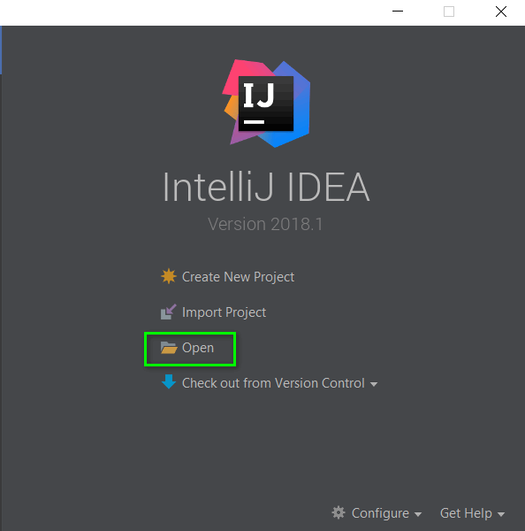
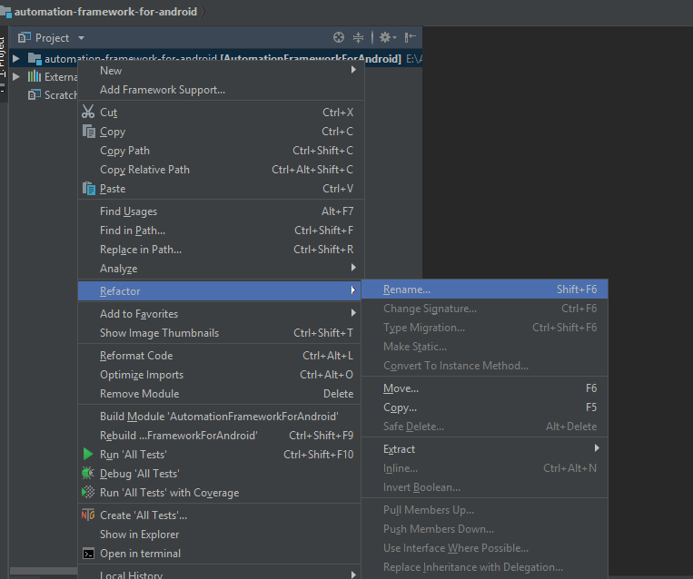
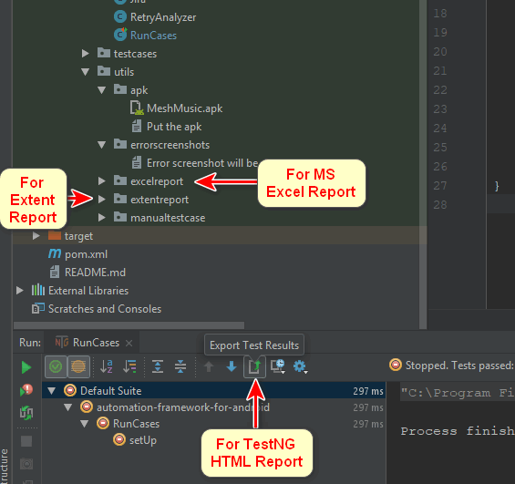

# Why this project
This is an `Automation Framework` for all types of Android application (Native, Hybrid, and Web), anyone can start writing the automation test case by cloning this project. It will reduce the initial time for starting automation project for any application. It will also reduce the test case development time.

# Key Features
* Reusable
* For Android Native, Hybrid, and Web application
* Automatic report generate in Excel and HTML format with error screenshot
* Up/Down/Right/Left swipe method included
* Automatic issue reporting on JIRA

# Info
* Language: `Jave`
* Version: 1.0.0
* Project Type: `Maven`
* Design Pattern: `Page Object Model(POM)` with `Page factory`, and  `Data Driven`
* Framework: [Appium](https://appium.io/), and [TestNG](http://testng.org/doc/documentation-main.html)
* Reporting System: MS Excel and [Extend Report](http://extentreports.com/)

# Prerequisite to use Framework 
* Install [ANDROID SDK](https://developer.android.com/studio/) and set environment variable path 
* Install [JDK](http://www.oracle.com/technetwork/java/javase/downloads/index.html) and set environment variable path
* Install [IntelliJ IDEA](https://www.jetbrains.com/idea/download/#section=windows)
* Install [Appium for Desktop](https://github.com/appium/appium-desktop/releases/)

# Let's start with Framework
* Clone the project

![Setp 1] (images/01.png)
![Setp 2] (images/02.png)
![Setp 3] (images/03.png)
* Go to the project folder and `Delete` the `.git` hidden folder
![hidden folder] (images/04.png)
* Open the project by IntelliJ IDEA

* Rename your project

* Good to go and enjoy the fun of Automation :)

# Help

* Export your desired test result

* [How to click on element by using `X` and `Y` coordinate](http://ezyautomation.blogspot.com/2018/08/how-to-clicktap-on-element-by-using-x.html)

